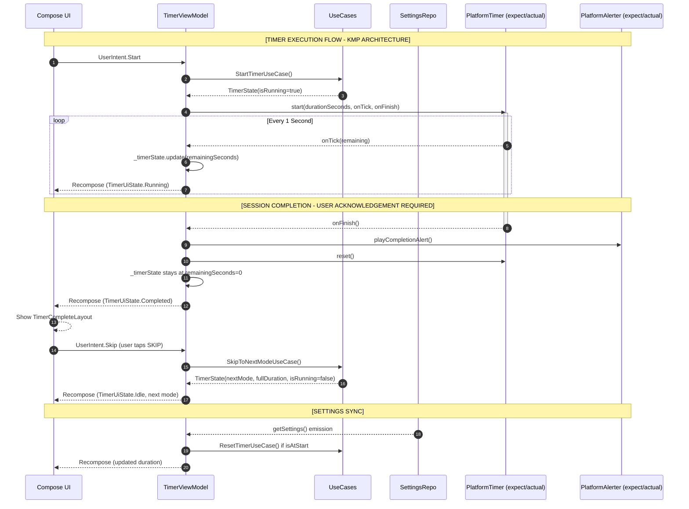
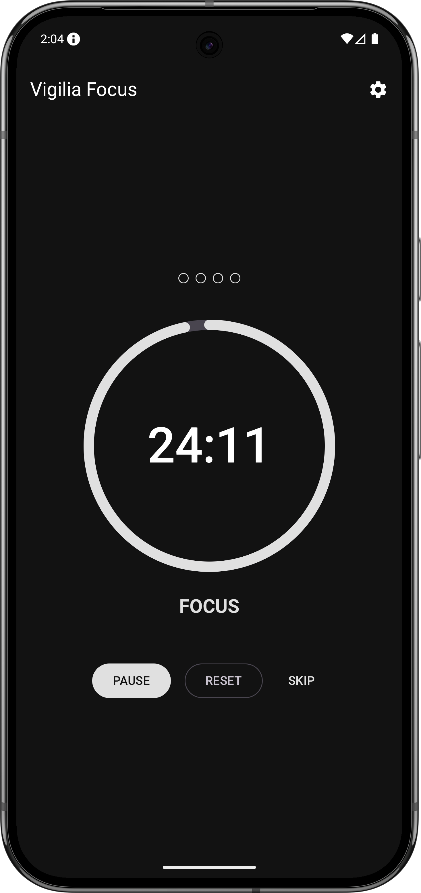
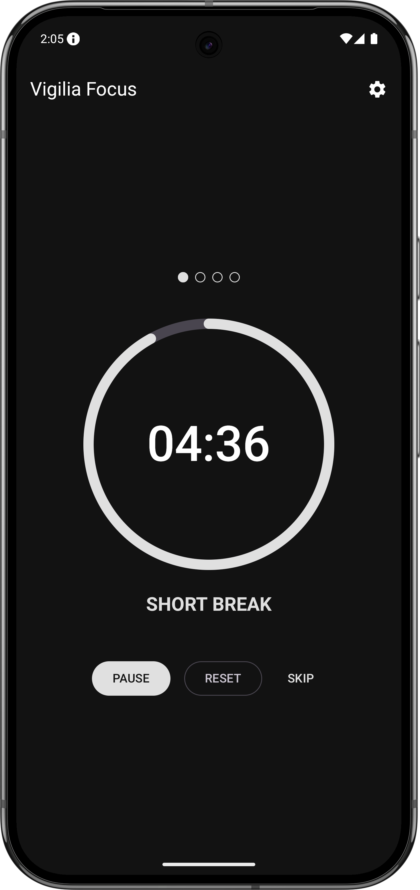
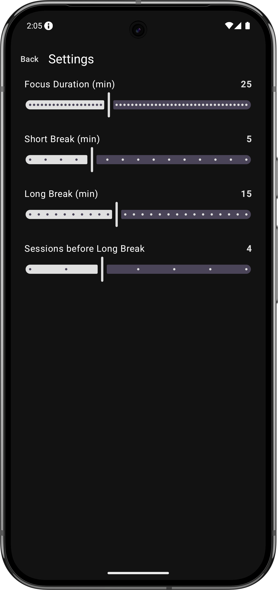
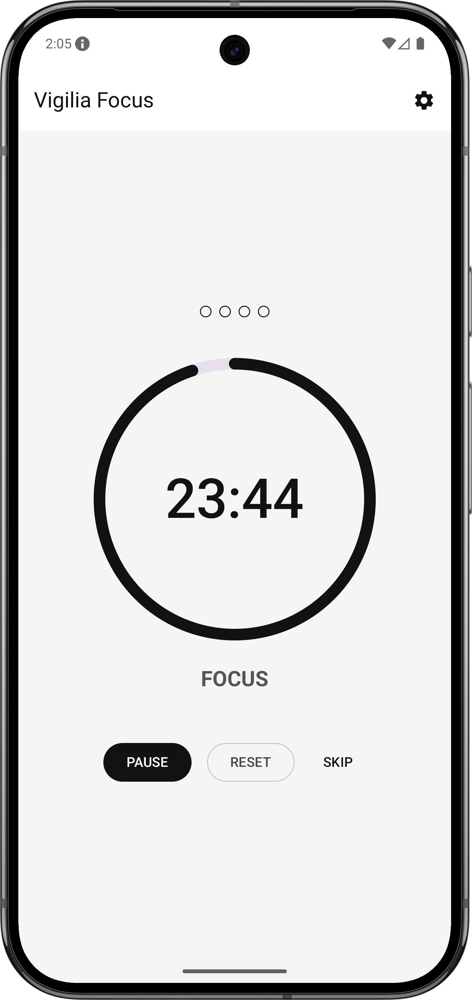
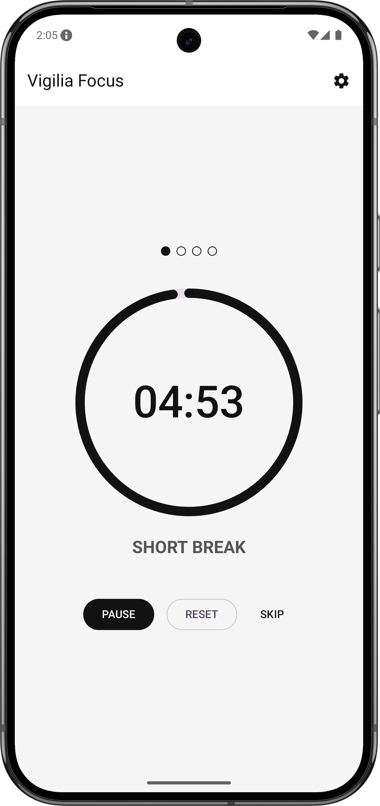
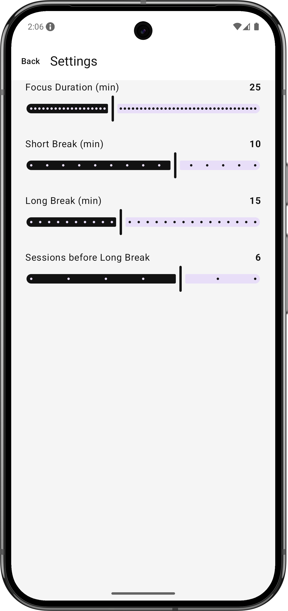

[](https://github.com/miggymamba/VigiliaFocus/actions/workflows/ci.yml)

# Vigiliа Focus

**Vigiliа Focus** is a Pomodoro timer built with Kotlin Multiplatform and Compose Multiplatform, targeting Android with iOS as a stretch goal.

Rather than treating a timer app as a trivial countdown, this project approaches it as a study in **shared cross-platform architecture** — proving that domain logic, UI state, and Compose UI can live entirely in `commonMain` while platform-specific concerns remain isolated in thin actuals.

## Key Features

- **Shared UI:** Compose Multiplatform renders the same UI on Android and iOS from a single `commonMain` source set.
- **Shared Domain:** Timer logic, session state, and use cases are pure Kotlin with zero platform imports.
- **MVI State Management:** Immutable `TimerUiState` driven by `StateFlow` ensures predictable rendering across configuration changes.
- **`expect/actual` Platform Bridge:** Platform clock and timer tick are abstracted behind a clean contract, with each target providing its own implementation.
- **Settings Persistence:** Timer durations survive app restarts via multiplatform-settings.
- **Foreground Service:** Active countdowns keep ticking in the background via an Android ForegroundService with a live notification.
- **Completion Feedback:** Audio and haptic alert on session end via `PlatformAlerter` — `RingtoneManager` + `Vibrator` on Android.

---

## Tech Stack


| Layer | Technology |
|---|---|
| UI | Compose Multiplatform — shared across Android and iOS |
| State | MVI — `StateFlow` + sealed interface |
| DI | Koin — KMP-native, no annotation processing |
| Persistence | Multiplatform Settings (`commonMain`) — settings storage |
| Platform Timer | `expect/actual` — wraps platform clock per target |
| Background | Android ForegroundService — keeps countdown alive when backgrounded |
| Navigation | Compose Navigation — single `NavHost` in `commonMain` |
| Testing | `kotlin.test` in `commonTest` + Compose UI tests in `androidDeviceTest` |
| CI | GitHub Actions |

---

## Technical Architecture

This project follows **Clean Architecture** with a KMP/CMP source set layout. Domain and UI are fully shared; platform actuals are thin and isolated.

### Source Set Breakdown

- **`commonMain`**: Compose UI, ViewModels, domain models, use cases, repository interfaces, and `expect` declarations. No platform imports.
- **`androidMain`**: Android actuals — `PlatformTimer.android.kt`, `PlatformAlerter.android.kt`, `TimerForegroundService.kt`.
- **`iosMain`**: iOS actuals — `PlatformTimer.ios.kt`. (Phase 6)
- **`androidApp`**: Entry point only — `MainActivity` calls `setContent { App() }`, nothing else.

```
VigiliаFocus/
├── composeApp/
│   ├── commonMain/       ← Compose UI, ViewModels, domain, use cases, data, expect
│   ├── androidMain/      ← PlatformTimer, PlatformAlerter, TimerForegroundService
│   └── iosMain/          ← PlatformTimer iOS actual (Phase 6)
└── androidApp/           ← Entry point only (MainActivity)
```

### Layer Breakdown

- **`domain/`**: Pure Kotlin. `TimerMode`, `TimerState`, `TimerSettings`, `Session`, use cases, and `ISettingsRepository` interface. Zero platform or Android dependencies.
- **`presentation/`**: `TimerViewModel`, `SettingsViewModel`, `TimerScreen`, `SettingsScreen`. MVI pattern — UI observes `StateFlow`, emits intents.
- **`platform/`**: `expect class PlatformTimer` and `expect class PlatformAlerter` — the only seams between shared and platform code.
- **`di/`**: Koin modules. `appModule` in `commonMain`, `androidModule` in `androidMain`.

---

## What This Project Demonstrates

- Shared Compose UI across Android and iOS from a single source set
- `expect/actual` pattern for platform capability bridging
- Clean Architecture applied to KMP — domain layer with zero platform imports
- Koin dependency injection in a multiplatform context
- MVI state management with `StateFlow` and sealed interfaces
- Explicit UI state machine — `TimerUiState` sealed interface routes `Idle`, `Running`, `Paused`, and `Completed` to dedicated composables
- Android ForegroundService integration with live notification updates
- `kotlin.test` unit testing in `commonTest` — no Android test runner required
- Compose UI instrumented tests in `androidDeviceTest`

---

## Development Setup

1. Clone the repository.
2. Open in **Android Studio Panda 2025.3.2** or later.
3. Sync Gradle.
4. Run on an Android emulator or device (API 26+).

---

## Testing Strategy

- **Domain Layer:** Use case and state transition tests in `commonTest` using `kotlin.test`. No mocking framework required — pure functions.
- **UI Layer:** `runComposeUiTest` instrumented tests in `androidDeviceTest` verifying timer display, Start/Pause toggle, mode label transitions, and the session completion screen.

---

## Sequence Diagram



---

## Screenshots

### Dark Mode

| Feature | Screenshot |
|---|---|
| Focus Mode (Running)  |  |
| Break Mode (Idle)  |  |
| Settings  |  |

### Light Mode

| Feature | Screenshot |
|---|---|
| Focus Mode (Running)  |  |
| Break Mode (Idle)  |  |
| Settings  |  |

---

## Future Roadmap

- **iOS Support:** `PlatformTimer.ios.kt` actual using `NSTimer` or `DispatchQueue`. Full iOS validation. (Phase 6)
- **Session History:** Persist completed sessions with timestamps for productivity tracking.

---

## License

Vigiliа Focus is licensed under the **Apache License 2.0**. See [LICENSE](LICENSE) for details.